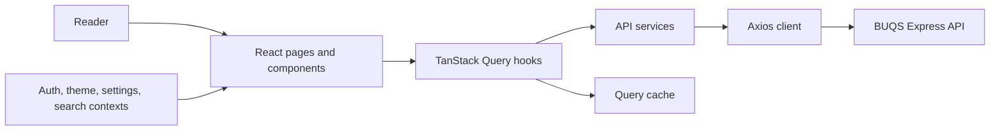
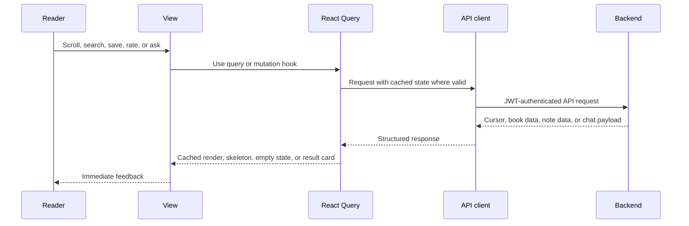
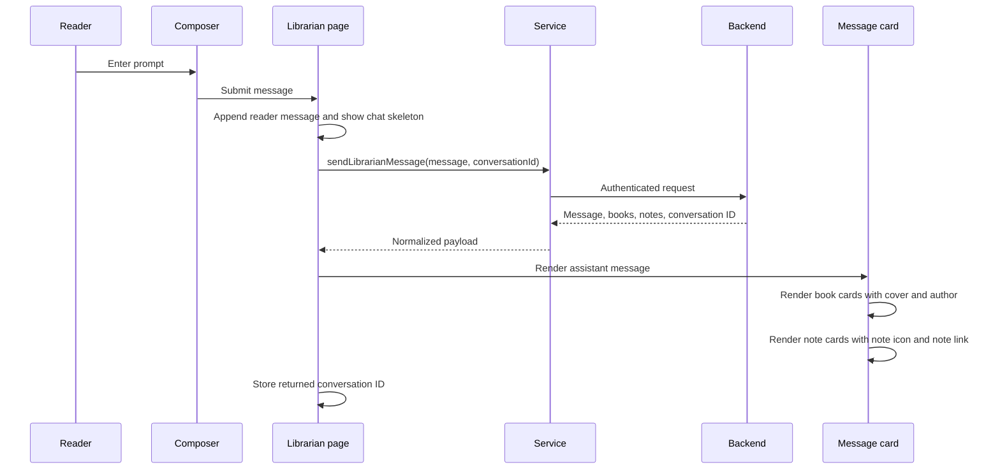

# BUQS Client

The React frontend for **BUQS**, a personalized book discovery app. The client is designed as the other half of a performance-conscious system: the backend provides cursor-paginated feeds, precomputed recommendations, and structured Librarian answers; the UI consumes them through cached queries, optimistic updates, responsive skeletons, and a consistent reading-focused design.

## BUQS Librarian demo

<video src="./Buqs-Librarian-Demo.mp4" controls muted playsinline width="100%"></video>

[Watch or download the BUQS Librarian demo](./Buqs-Librarian-Demo.mp4)


## Highlights

- Infinite Discovery, For You, Trending, search, genre, and library views driven by cursor-based React Query infinite queries
- Debounced autocomplete with keyboard navigation and a portal-rendered dropdown
- Optimistic library and rating updates with background reconciliation
- URL-driven sort and genre filters that survive refreshes and can be shared
- Email/password and Google OAuth with protected routes and session restoration
- Persistent dark mode and Safe Mode settings
- Personal library, notes, immutable one-to-five star ratings, and book detail views
- The Librarian chat for books, notes, reading history, and conversational follow-ups
- Structured chat cards with real cover images, author names, book routes, note routes, response skeletons, and accessible empty states
- Responsive Tailwind and shadcn/ui interface with a consistent light and dark visual system

## Client architecture



## Data flow



## Why TanStack Query

Server state is handled through TanStack Query rather than ad-hoc `useEffect` and `fetch` calls. This makes loading, error, retry, cache invalidation, and pagination behave consistently across the app.

- Infinite queries forward the backend’s `nextCursor`; the client never invents an offset.
- Similar-book results use a 24-hour client cache aligned with the backend cache policy.
- Immutable user ratings use an infinite stale time because the backend does not permit re-rating.
- Library and rating mutations update the query cache optimistically, then invalidate the relevant query to reconcile safely.

## Search, filters, and navigation

Search deliberately separates autocomplete from committed search. A 300 ms debounced query drives lightweight suggestions while a submitted query controls the full result page. The suggestion menu renders through a React portal so it is not clipped by layout overflow or trapped in a stacking context.

Genre and sort filters live in `useSearchParams`, not transient component state. A URL can therefore restore a filtered view after refresh, be shared, and work correctly with browser history.

## The Librarian interface

The Librarian is a focused chat surface rather than a generic messenger. It supports discovery questions, personal history, notes, book details, and natural follow-ups such as `this`, `that`, `these`, `more by him`, and `something else`.

### Librarian client architecture

```mermaid
flowchart LR
  U[Reader] --> L[Librarian page]
  L --> MS[Message state]
  L --> CO[Composer]
  CO --> LS[librarianService]
  LS --> AX[Axios API client]
  AX --> API[POST /api/librarian/chat]
  API --> AX
  AX --> LS
  LS --> NM[Normalized chat payload]
  NM --> LM[LibrarianMessage]
  LM --> BC[Book cards]
  LM --> NC[Note cards]
  BC --> BR[/books/:isbn]
  NC --> NR[/notes/:id]
```

The page owns the conversation ID and sends it on each follow-up. The backend then resolves active references, such as the last author or genre, without the client trying to interpret natural language. The frontend’s responsibility is narrow and predictable: submit a message, render the structured response, maintain an accessible pending state, and route readers to the selected book or note.

### Librarian UI flow



### Rendering contract and resilience

The service normalizes every response into one renderable shape before it reaches message components. This prevents a common chat UI bug where initial results use a different field path than follow-up results and lose cover images.

| UI concern | Implementation intent |
|---|---|
| First response and follow-ups | Both use the same normalized `books` and `notes` arrays. |
| Covers | Book cards use `cover_image` from the structured backend response and fall back only when an image is unavailable. |
| Authors | Book cards display the returned author string, not a generic label. |
| Notes | Note cards use a generic note icon and route to `/notes/:id`. |
| Pending request | The chat area shows its own skeleton while the fixed composer remains aligned and usable after completion. |
| Failure | The request error renders as a calm, actionable assistant message rather than leaving an empty pending card. |
| Theme | Surface, border, halo, and text tokens are theme-aware to avoid harsh light-mode borders or dark-mode corner artifacts. |

### Client and server responsibility split

The client does not attempt to resolve natural-language references locally. It persists the returned conversation ID, sends the raw follow-up text, and renders the normalized response. The server owns intent detection, reference resolution, authorization, data queries, shown-book exclusion, and fallback policy. This prevents two sources of truth for conversational state and means a refreshed client can resume a valid server-side conversation while its Redis context is alive.

```mermaid
flowchart TB
  UI[React Librarian page] -->|message + conversationId| API[POST /api/librarian/chat]
  API -->|message + books + notes + conversationId| UI
  UI -->|book click| BOOK[/books/:isbn]
  UI -->|note click| NOTE[/notes/:id]
  UI -->|pending| SKELETON[Conversation skeleton]
  UI -->|error| RECOVERY[Retryable assistant error state]
```

This is especially important for the first result in a conversation. `librarianService` normalizes every response to the same book and note arrays before `LibrarianMessage` renders, so first-message cover images and author names use the same mapping as later results.

The UI renders structured backend results instead of trying to infer cards from prose:

- Book cards use the returned `cover_image`, title, author, and route.
- Notes use a generic note icon and open the matching personal note.
- The first response and every subsequent response share the same card mapping, so covers do not disappear on a first prompt.
- The conversation area has its own skeleton state and keeps the composer stable while a request is pending.
- The visual halo, borders, and composer are token-based so light and dark themes remain smooth and readable.

## Technology

| Area | Technology |
|---|---|
| Framework | React 18 and Vite |
| Routing | React Router v6 |
| Server state | TanStack Query |
| Forms | React Hook Form and Zod |
| Styling | Tailwind CSS, shadcn/ui, Radix UI primitives, CSS variables |
| HTTP | Axios with a JWT request interceptor |
| Authentication | JWT and `@react-oauth/google` |
| Icons | lucide-react |
| Infinite scroll | react-intersection-observer |
| Notifications | Sonner |
| Deployment | Azure Static Web Apps and GitHub Actions |

## Project layout

```text
buqs-client/
├── src/
│   ├── Context/
│   ├── api/
│   ├── components/
│   │   ├── ui/
│   │   ├── LibrarianComposer.jsx
│   │   └── LibrarianMessage.jsx
│   ├── hooks/
│   ├── pages/
│   │   └── Librarian.jsx
│   ├── services/
│   │   └── librarianService.js
│   └── utils/
├── staticwebapp.config.json
└── .github/workflows/
```

## Routes

```text
/auth
/forgot-password
/reset-password/:resetToken
/
/for-you
/search
/notes
/notes/:id
/books/:isbn
/library
/genre/:slug
/librarian
```

Protected routes redirect to `/auth` when there is no authenticated user. During initial session verification, views show a skeleton instead of briefly rendering the wrong state.

## UI regression prompts

Use these in the Librarian screen to verify structured cards, cover handling, note links, and follow-up state.

1. `What have I rated recently?`
2. `Show me books similar to my last read`
3. `Show some more like this`
4. `Give me books by George Orwell`
5. `Give me the highest rated among these books`
6. `Give me some highly rated horror books`
7. `Some other horror books`
8. `Tell me about The Palace of Illusions by Chitra Banerjee Divakaruni`
9. `Show me my notes`
10. `Do I have a note about The Lake House?`

For each book result, confirm that the card displays a cover and author and routes to `/books/:isbn`. For each matching note, confirm that its card routes to `/notes/:id`.


## Production deployment

The client deploys to Azure Static Web Apps through GitHub Actions. Pushes to `main` build and deploy the production site, while pull requests receive preview environments. `staticwebapp.config.json` provides SPA navigation fallback so direct deep links such as `/books/9780123456789` and `/librarian` resolve correctly.

## Technical notes

The client intentionally mirrors the backend’s performance and correctness model rather than treating API calls as isolated component concerns:

- **Cursor alignment:** React Query infinite queries forward the cursor returned by PostgreSQL-backed endpoints, avoiding offset drift and duplicate scrolling work.
- **Cache policy follows product rules:** similar books use a long-lived cache because the server also caches them; immutable ratings can safely use an infinite stale time.
- **Mutation safety:** optimistic UI updates improve responsiveness, while cache invalidation restores the server as the source of truth.
- **URL-as-state:** sorting and genre filters stay shareable, refresh-safe, and compatible with browser history.
- **Accessible perceived performance:** skeletons cover session restoration, feeds, and chat responses so the app never looks frozen while data is loading.
- **Boundary discipline:** contexts own client-side concerns such as authentication, search input, theme, and settings; React Query owns remote server state; services remain thin API wrappers.
